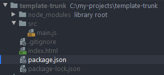

# Запуск Babel

После того как мы установили

1. `@babel/core`
2. `@babel/cli`
3. Нужные нам `plugins`

Eго можно запустить

Команда для запуска плагина

    npx babel src --out-dir build --plugins @babel/plugin-transform-template-literals



Где

- `npx babel` - запуск самого babel
- `src` - путь к `.js` файлам, в данном примере это папка `src`
- `—out-dir build` - путь куда babel положит результат, в данном примере это папка `build`
- `—plugins` - директива после которой мы перечисляем плагины, которые нужно задействовать при компиляции JavaScript
- `@babel/plugin-transform-template-literals` - один из плагинов Babel, который отвечает за Template Literals, что уже понятно из самого названия плагина. Он изменяет ```` на обычные `'' или ""`

### Начальный файл и итоговый результат

    class App {
    
      constructor(name) {
        this.name = name
      }
    
      getName() {
        return this.name
      }
    
      sayHello(msg) {
        console.log(`Hello ${msg}`)
      }
    }
    
    const app = new App('Andrii Helever')
    app.sayHello(app.getName())

**Результат**

    class App {
      constructor(name) {
        this.name = name;
      }
    
      getName() {
        return this.name;
      }
    
      sayHello(msg) {
        console.log("Hello ".concat(msg));
      }
    
    }
    
    const app = new App('Andrii Helever');
    app.sayHello(app.getName());

### Список всех плагинов

[https://babeljs.io/docs/en/plugins](https://babeljs.io/docs/en/plugins)